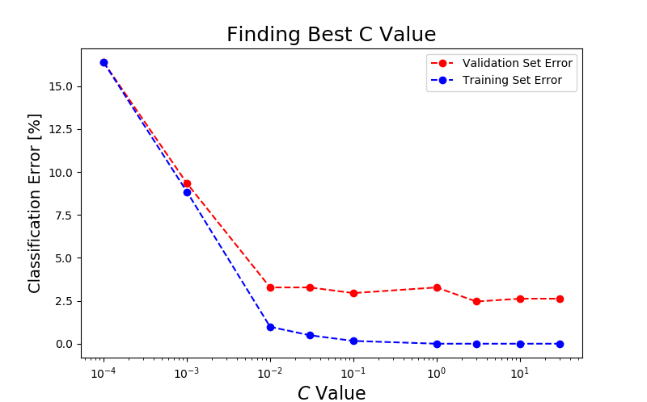

PRÁCTICA 6. MEMORIA TÉCNICA
===============	

> Sergio Gavilán Fernández <sgavil01@ucm.es>

> Alejandro Villar Rubio <alvill04@ucm.es>


---

### PARTE 1

---

```py

```

---

### PARTE 2

---

En esta parte hemos utilizado las SVM para hacer un sistema que detecte spam en los e-mail. Hemos empezado leyendo los archivos de spam y guardándalos, haciendo lo mismo con los de no spam para así tener dos conjuntos de datos separados. El siguiente paso ha sido limpiar los email(quitando cabeceras y otros datos innecesarios) obteniendo por cada e-mail un array con las palabras relevantes , sustituyendo los números por 'number' entre otros ajustes.

Acto seguido hemos transformado cada array de cada email en un array de 0s y 1s en función de un diccionario de palabras, ocupando un 1 en la posición n-esima si la palabra está en el mail y un 0 en caso contrario.

Después, se han dividido esos arrays en 3 conjuntos de datos:  
* Conjunto de entrenamiento (60% del total)
* Conjunto de validación (20% del total)
* Conjunto de prueba (20% del total)

Se han creado las correspondientes etiquetas a esos conjuntos (array 'y' de 0s o 1s si es spam o no), se ha ajustado una SVM de kernel lineal a los ejemplos de entrenamiento y se ha hecho una predicción con los conjuntos de validación y entrenamiento utilizando distintos valores de **C desde 0.0001 a 30.0**. Con estos datos se ha creado una gráfica para observar cuál es el menor error de validación ( viéndose que los mejores valores eran 0.1 y 3.0). 




Por último, se ha probado una SVM con un kernel lineal y ambos valores de C una predicción de los ejemplos de entrenamiento, obteniendo que el mejor valor de C es 0.1 con un porcentaje de acierto de un *98.69%* frente a un *97.38%* con C = 3.0.

Concluimos la parte 2 sabiendo que para tener un sistema óptimo de clasificación de spam podemos utilizar una SVM de kernel lineal con un valor de *C=0.1*


```py
from process_email import email2TokenList
import codecs
from get_vocab_dict import getVocabDict
import numpy as np
import os
from sklearn import svm
import matplotlib.pyplot as plt


vocab_dict = getVocabDict()


def convertToIndices(token):

    indicesOfWords = [vocab_dict[t] for t in token if t in vocab_dict]
    result = np.zeros((len(vocab_dict), 1))
    for index in indicesOfWords:
        result[index-1] = 1
    return result


def read_spam():
    spam_emails = []
    directorio = "spam"
    i = 1
    for spam_email in os.listdir(directorio):
        email_contents = codecs.open(
            '{0}/{1:04d}.txt'.format(directorio, i), 'r', encoding='utf-8', errors='ignore').read()
        tokens = email2TokenList(email_contents)
        tokens = convertToIndices(tokens)
        i += 1
        spam_emails.append(tokens)

    print("Spam Readed: ", i - 1)
    return spam_emails


def read_easyHam():
    no_spam_emails = []
    directorio = "easy_ham"
    i = 1
    for no_spam in os.listdir(directorio):
        email_contents = codecs.open(
            '{0}/{1:04d}.txt'.format(directorio, i), 'r', encoding='utf-8', errors='ignore').read()
        tokens = email2TokenList(email_contents)
        tokens = convertToIndices(tokens)
        i += 1
        no_spam_emails.append(tokens)
    print("Easy Ham Readed: ", i-1)
    return no_spam_emails


def separate_sets(spam_emails, no_spam_emails):
    # Cogemos el 60% de los spam y no spams como set de entrenamiento
    n_nonspam_train = int(len(no_spam_emails)*0.6)
    n_spam_train = int(len(spam_emails) * 0.6)

    nonspam_train = no_spam_emails[:n_nonspam_train]
    spam_train = spam_emails[:n_spam_train]

    # Unimos los spam y no spam
    Xtrain = np.concatenate(nonspam_train+spam_train, axis=1).T
    ytrain = np.concatenate(
        (np.zeros((n_nonspam_train, 1)),
         np.ones((n_spam_train, 1))
         ), axis=0)

    # Por otro lado el 20% para el set de validacion
    n_nonspam_cv = int(len(no_spam_emails)*0.2)
    n_spam_cv = int(len(spam_emails) * 0.2)

    nonspam_cv = no_spam_emails[n_nonspam_train:n_nonspam_train+n_nonspam_cv]
    spam_cv = spam_emails[n_spam_train:n_spam_train+n_spam_cv]

    Xval = np.concatenate(nonspam_cv+spam_cv, axis=1).T
    yval = np.concatenate(
        (np.zeros((n_nonspam_cv, 1)),
         np.ones((n_spam_cv, 1))
         ), axis=0)

    # Por ultimo el 20% restante para el conjunto de prueba
    n_nonspam_test = len(no_spam_emails) - n_nonspam_train - n_nonspam_cv
    n_spam_test = len(spam_emails) - n_spam_train - n_spam_cv

    nonspam_test = no_spam_emails[-n_nonspam_test:]
    spam_test = spam_emails[-n_spam_test:]

    Xtest = np.concatenate(nonspam_test+spam_test, axis=1).T
    ytest = np.concatenate(
        (np.zeros((n_nonspam_test, 1)),
         np.ones((n_spam_test, 1))
         ), axis=0)

    return Xtrain, ytrain, Xval, yval, Xtest, ytest


def draw_C_values(C_test_values, error_train, error_val):
    plt.figure(figsize=(8, 5))
    plt.plot(C_test_values, error_val, 'or--', label='Validation Set Error')
    plt.plot(C_test_values, error_train, 'bo--', label='Training Set Error')
    plt.xlabel('$C$ Value', fontsize=16)
    plt.ylabel('Classification Error [%]', fontsize=14)
    plt.title('Finding Best C Value', fontsize=18)
    plt.xscale('log')
    plt.legend()
    plt.show()


def find_better_C(Xtrain, ytrain, Xval, yval):
    C_test_values = [0.0001, 0.001, 0.01, 0.03, 0.1, 1.0, 3.0, 10.0, 30.0]
    error_train = []
    error_val = []
    print('C\tTrain Error\tValidation Error\n')
    for testing_c in C_test_values:

        linear_svm = svm.SVC(C=testing_c, kernel='linear')

        # Ajustamos el kernel a los ejemplos de entrenamiento
        linear_svm.fit(Xtrain, ytrain.flatten())

        # Comprobamos el error con el set de validacion
        cv_predictions = linear_svm.predict(Xval).reshape((yval.shape[0], 1))
        validation_error = 100. * \
            float(sum(cv_predictions != yval))/yval.shape[0]
        error_val.append(validation_error)

        # comprobamos tambien el error con el set de entrenamiento
        train_predictions = linear_svm.predict(
            Xtrain).reshape((ytrain.shape[0], 1))
        train_error = 100. * \
            float(sum(train_predictions != ytrain))/ytrain.shape[0]
        error_train.append(train_error)

        print('{}\t{}\t{}\n'.format(testing_c, train_error, validation_error))

    draw_C_values(C_test_values, error_train, error_val)

    # De la gráfica y los valores de los errores podemos observar que los mejores valores de C son 0.1 y 3.0
    # aunque parece mejor 0.1 ya que 3.0 sobreajusta a los ejemplos de entrenamiento


def best_c_testing(Cval, Xtrain, ytrain, Xtest, ytest):
    best_svm = svm.SVC(C=Cval, kernel='linear')
    best_svm.fit(Xtrain, ytrain.flatten())

    test_predictions = best_svm.predict(Xtest).reshape((ytest.shape[0], 1))
    test_acc = 100. * float(sum(test_predictions == ytest))/ytest.shape[0]
    print(f'Test set accuracy using C ={Cval} = %0.2f%%' % test_acc)


def main():
    spam_set = read_spam()
    noSpam_set = read_easyHam()
    Xtrain, ytrain, Xval, yval, Xtest, ytest = separate_sets(
        spam_set, noSpam_set)

    find_better_C(Xtrain, ytrain, Xval, yval)

    best_c_testing(0.1, Xtrain, ytrain, Xtest, ytest)
    best_c_testing(3.0, Xtrain, ytrain, Xtest, ytest)

    # podemos observar que 0.1 es un valor que se ajusta mejor que 3.0


main()

```
